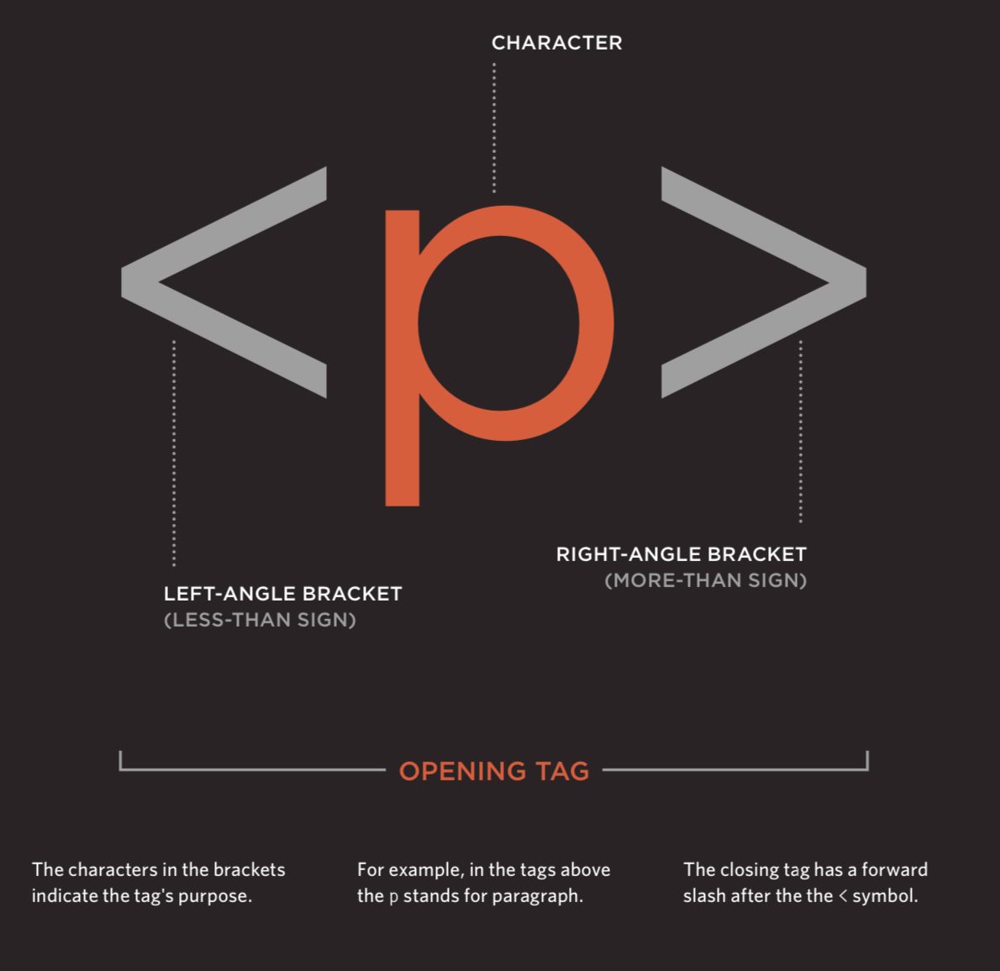
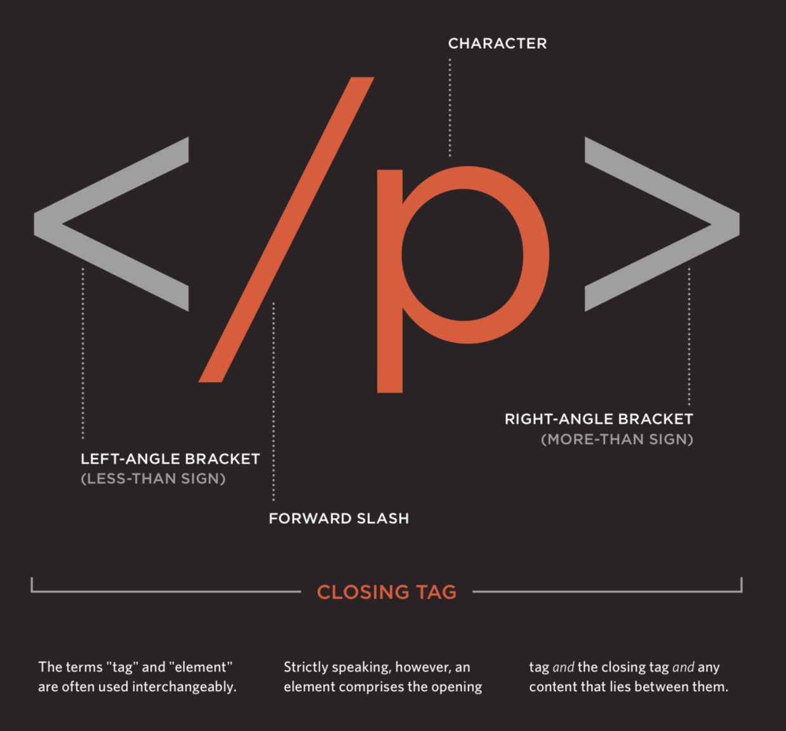
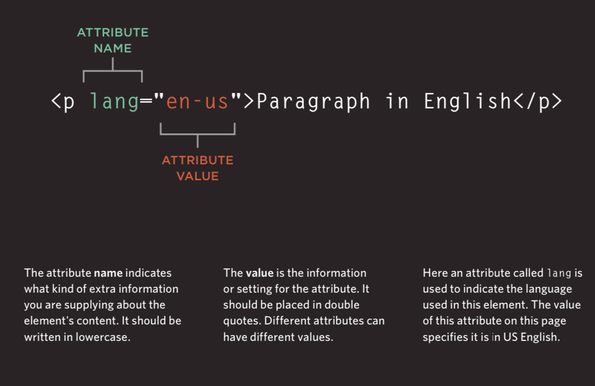

# HTML 5 and CSS

## Quick HTML5 Guide for Beginners

### 1. What is HTML5?
HTML5 is the latest version of the Hypertext Markup Language (HTML), used to structure content on the web. It introduces new semantic elements that provide meaning to your HTML structure.

#### What are tags?





### 

### 2. Key Semantic Tags:

`<header>`
  : Represents introductory content or a set of navigational links.
`<nav>`
  : Defines a set of navigation links.
`<main>`
  : Specifies the main content of the document, unique to the document.
`<section>`
  : Represents a thematic grouping of content, typically with a heading.
`<article>`
  : Used for self-contained content that can be independently distributed or reused.
`<aside>`
  : Contains content that is tangentially related to the main content.
`<footer>`
  : Represents the footer for a section or the whole document, typically containing metadata or links.

### 3. Example Structure:

```html
<!DOCTYPE html>
<html lang="en">
<head>
    <meta charset="UTF-8">
    <meta name="viewport" content="width=device-width, initial-scale=1.0">
    <title>HTML5 Example</title>
</head>
<body>
    <header>
        <h1>My Website</h1>
        <nav>
            <ul>
                <li><a href="#home">Home</a></li>
                <li><a href="#about">About</a></li>
                <li><a href="#contact">Contact</a></li>
            </ul>
        </nav>
    </header>
    <main>
        <section id="home">
            <h2>Welcome</h2>
            <p>This is the home page.</p>
        </section>
        <section id="about">
            <h2>About Us</h2>
            <p>Information about our company.</p>
        </section>
        <article>
            <h3>Latest News</h3>
            <p>Some recent news article.</p>
        </article>
    </main>
    <aside>
        <h4>Related Links</h4>
        <p>Links to related content.</p>
    </aside>
    <footer>
        <p>&copy; 2024 My Website</p>
    </footer>
</body>
</html>
```

## Quick CSS Guide for Beginners

### 1. What is CSS?
CSS (Cascading Style Sheets) is used to style and layout web pages. It controls the visual presentation of HTML elements.

### 2. The Box Model:
The box model represents the structure of a web element and includes:

Content
  : The actual content of the box (text, image, etc.). Innermost part.
Padding
  : Space between the content and the border. It affects the element's size without affecting layout.
Border
  : A border surrounding the padding (if any) and content. It can have varying widths and styles.
Margin
  : The outermost layer, creating space between the element and its neighboring elements. It affects the layout by pushing adjacent elements away.

```css
  /* Example */
  div {
    width: 100px;
    height: 100px;
    padding: 10px;
    border: 2px solid black;
    margin: 20px;
  }
```

#### Hierarchical Nature of the Box Model:

Each element's box model is contained within its parent element's box model, creating a hierarchical structure. This hierarchy starts from individual elements and continues up to the root <html> element.

Nested Elements: Child elements are contained within their parent elements, inheriting their properties and positioning.

Hierarchy Example: If a child element has padding, its padding is within the parent’s padding, border, and margin.

```html
<!DOCTYPE html>
<html lang="en">
<head>
    <meta charset="UTF-8">
    <meta name="viewport" content="width=device-width, initial-scale=1.0">
    <title>Box Model Example</title>
    <style>
        .parent {
            width: 300px;
            height: 300px;
            padding: 20px;
            border: 5px solid blue;
            margin: 30px;
            background-color: lightgray;
        }
        .child {
            width: 100px;
            height: 100px;
            padding: 10px;
            border: 2px solid red;
            margin: 10px;
            background-color: white;
        }
    </style>
</head>
<body>
    <div class="parent">
        <div class="child">Child Element</div>
    </div>
</body>
</html>

```

#### Box Sizing:
CSS provides the box-sizing property to control how the box model calculates the width and height of elements.

- content-box: Default value. Width and height include only the content, excluding padding and border.
- border-box: Width and height include content, padding, and border.

```css
/* Example */
div {
  box-sizing: border-box;
}
```

### 3. Flexbox:

Flexbox is a layout model that allows for responsive and flexible layouts.

Container Properties:

display
  : flex: Establishes a flex container.
flex-direction
  : Defines the direction of flex items (row, column).
justify-content
  : Aligns items horizontally.
align-items
  : Aligns items vertically.

Item Properties:

flex-grow
  : Defines the ability for a flex item to grow.
flex-shrink
  : Defines the ability for a flex item to shrink.
flex-basis
  : Defines the initial size of a flex item.

```css
  /* Example */
  .container {
    display: flex;
    justify-content: center;
    align-items: center;
  }

  .item {
    flex-grow: 1;
  }
```

### 4. Responsive Design:

Responsive design ensures web pages look good on all devices. Key techniques include:

- Media Queries: Apply styles based on device characteristics (width, height).

```css
/* Example */
@media (max-width: 600px) {
.container {
  flex-direction: column;
}
}
```

- Flexible Layouts: Use relative units (%, em, rem) and flexible grid systems (like Flexbox or CSS Grid).

### 5. Example:

Combining the above concepts into a responsive layout.

```html
<!DOCTYPE html>
<html lang="en">
<head>
  <meta charset="UTF-8">
  <meta name="viewport" content="width=device-width, initial-scale=1.0">
  <title>CSS Example</title>
  <style>
      .box {
          width: 100px;
          height: 100px;
          padding: 10px;
          border: 2px solid black;
          margin: 20px;
      }
      .container {
          display: flex;
          justify-content: center;
          align-items: center;
      }
      @media (max-width: 600px) {
          .container {
              flex-direction: column;
          }
      }
  </style>
</head>
<body>
  <div class="container">
      <div class="box">Box 1</div>
      <div class="box">Box 2</div>
  </div>
</body>
</html>
```
